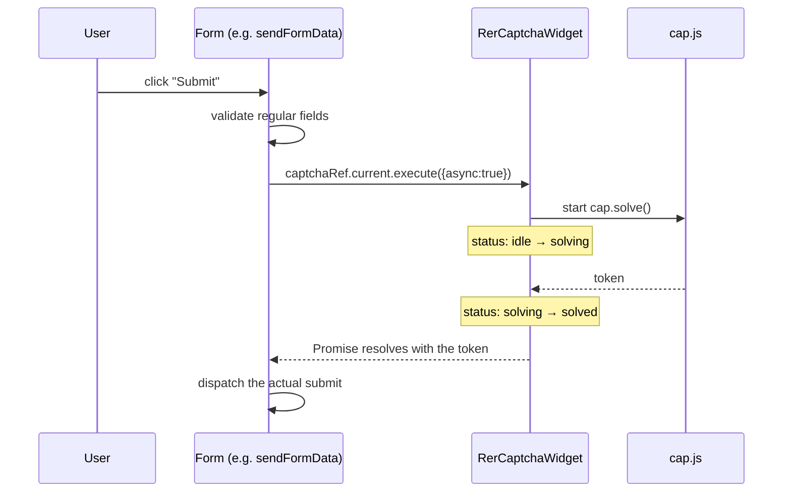
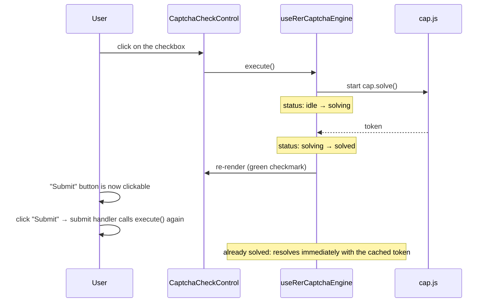

# How it works

## The two modes

Decided by the `show-button` flag, exposed by the backend alongside the
other captcha data in the `rercaptcha-data` expander (`show_button`
registry field in `IRerCaptchaSettings`, captcha control panel).

### Invisible (default)

No button. The widget's consumer calls
`captchaRef.current.execute({ async: true })` in its own submit handler;
the computation starts at that moment, not before, and the actual submit
waits for the Promise to resolve.



If the computation takes longer than expected (600ms threshold),
`CaptchaPendingFeedback` shows up (inline text or a dimmed full-screen
overlay, depending on the `pendingFeedbackVariant` prop).

### Explicit button

The widget renders a checkbox; the user must click it to start the
verification. The form's submit button stays blocked (no token) until the
verification completes — see the
[section on pre-blocking submit](#blocking-submit-in-the-consuming-form)
below for how to do this in your own form.



If the computation fails (network, service unreachable), a red X
"Verification failed" shows up with a "Retry" button — it calls
`execute()` again, which retries because the state is no longer `idle`.

## Integrating the widget in a new form

```jsx
import { useRef } from 'react';
// eslint-disable-next-line import/no-unresolved
import RerCaptchaWidget from '@regioneer/volto-collective-rercaptcha/components/Widget/FormWidget/RerCaptchaWidget';

const MyForm = () => {
  const captchaRef = useRef();

  const handleSubmit = async () => {
    if (isInvalid()) return; // validate regular fields first, captcha after

    const token = await captchaRef.current?.execute({ async: true });

    dispatch(submitSomething({ ...formData, 'capjs-token': token }));
  };

  return (
    <form onSubmit={handleSubmit}>
      {/* ...fields... */}
      <RerCaptchaWidget
        id="capjs-token"
        captchaRef={captchaRef}
        onChangeFormData={(id, label, value) => setFormData({ ...formData, [id]: value })}
      />
      <button type="submit">Submit</button>
    </form>
  );
};
```

Important points:

- **Passing `captchaRef` is what activates the new behaviour**
  (invisible-on-submit or button). Without this prop, the widget stays in
  legacy mode: eager computation on mount, historical behaviour — useful
  only to avoid regressions in integration points not yet updated, to be
  avoided in new code.
- **Use the value returned by `execute()`, don't re-read state after the
  wait**: `formData`/local state might not be updated yet by the time the
  Promise resolves (stale closure).
- **`captchaToken` is optional**: if your form already has a shared ref
  for the token (like the Form block's `Captcha.jsx`), passing it lets
  `execute()` short-circuit immediately once it's already resolved. If you
  don't pass it (like Customer Satisfaction and Newsletter), the widget
  still tracks the token internally — no behavioural difference.
- **`reset()`** (exposed on the same `captchaRef`) should be called after
  a successful submit only if the form can actually be resubmitted
  without reloading the page (cap.js tokens are single-use).

### Blocking submit in the consuming form

If `show-button` is active, **your own** form's submit button must be
disabled until the verification completes (otherwise the form can be
submitted without ever clicking the checkbox). Use
`useRerCaptchaShowButton()` (not a local flag):

```jsx
// eslint-disable-next-line import/no-unresolved
import { useRerCaptchaShowButton } from '@regioneer/volto-collective-rercaptcha/hooks/useRerCaptchaShowButton';

const showsOwnButton = useRerCaptchaShowButton();
const blocksSubmit = showsOwnButton && !hasToken; // hasToken: however your form tracks the token

<button type="submit" disabled={blocksSubmit}>Submit</button>
```

In invisible mode (`showsOwnButton === false`) this condition is always
`false`: the button stays clickable, because the token doesn't exist yet
before the click (the click itself is what starts the computation).
**Never pre-block submit based solely on "the token doesn't exist yet"**
without distinguishing the mode: that's the exact deadlock already hit
once on `FormView.jsx` (submit would never unblock, because in invisible
mode the token is only generated by the click itself).

## Automatic renewal on token expiry

`cap.js` arms an internal timer based on the `expires` field returned by
the service; on expiry it emits a `reset` event, which
`useRerCaptchaEngine` intercepts to put the state back to `idle`, clear
the token, and remount the engine (new `generation`) — ready for a new
computation on the next request, with no action needed from the consumer.
In button mode, this visually brings the checkbox back to "needs
verification".
